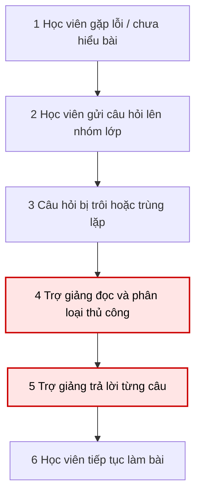
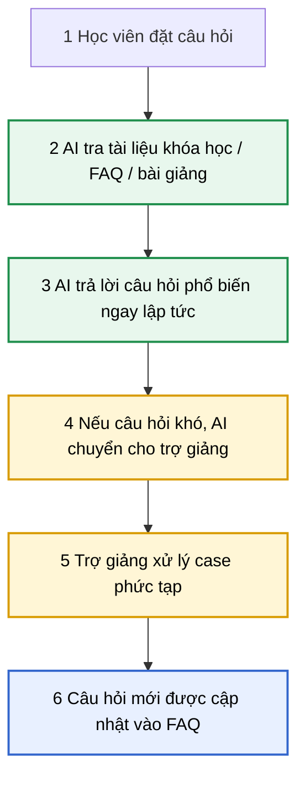

# Day 02 Lab — AI Problem Statement

Repo này là bài nộp Day 02 Lab, gồm 3 phần chính:

```text
Day02-2A202600749-Nguyễn Sỹ Minh/
├── README.md
├── 01-individual-problem-scan.md
│   
├── 02-group-problem-statement.md
│
└── 03-individual-reflection.md
```

---

## Chủ đề bài làm

**Case:** Khóa học AI thực chiến do tập đoàn Vin tổ chức.

Bài làm tập trung vào việc phân tích các điểm đau trong quá trình học, đặc biệt là khi lớp học có số lượng học viên lớn, số lượng trợ giảng/mentor có hạn và học viên cần được hỗ trợ kịp thời.

---

## 01 — Individual Problem Scan

Thư mục này chứa phần scan cá nhân.

### Nội dung chính

- Scan rộng các vấn đề trong bối cảnh học khóa AI thực chiến.
- Chọn Top 3 problems.
- Viết Problem Cards cho từng problem.
- Vẽ workflow hiện tại và workflow tương lai.
- Chuyển điểm đau thành metric định lượng.

### Top 3 problems

| Rank | Problem | Lý do chọn |
|---|---|---|
| 1 | Đi học xa sau giờ làm | Pain rõ, đo được bằng thời gian, chi phí và mức độ mệt mỏi |
| 2 | Trợ giảng quá tải khi lớp đông | Nhiều câu hỏi lặp lại, ảnh hưởng trực tiếp đến tốc độ hỗ trợ học viên |
| 3 | Feedback bài tập chậm và chưa cá nhân hóa | Ảnh hưởng đến khả năng cải thiện bài làm của học viên |

### Problem ưu tiên cá nhân

```text
Đi học xa sau giờ làm khi tham gia khóa AI thực chiến.
```

### Metric chính

| Metric | Trước | Sau kỳ vọng |
|---|---:|---:|
| Thời gian đi lại/tháng | Khoảng 12 giờ | Dưới 3 giờ |
| Chi phí đi lại/tháng | 800k–1.2 triệu VNĐ | Giảm 70% |
| Tỷ lệ đi học đúng giờ | Khoảng 70% | Trên 90% |
| Tỷ lệ hoàn thành bài tập | 60–70% | Trên 80% |

---

## 02 — Group Problem Statement

Thư mục này chứa phần làm nhóm.

### Workflow được nhóm chọn

```text
Trợ giảng quá tải khi lớp đông.
```

### Group convergence

Nhóm gom các candidate problems thành 4 cluster:

| Cluster | Pattern chung |
|---|---|
| Hỗ trợ học viên trong lớp đông | Học viên cần hỗ trợ đúng lúc, trợ giảng bị quá tải bởi câu hỏi lặp lại |
| Giảm tải vận hành cho mentor | Mentor mất nhiều thời gian theo dõi, tổng hợp và nhắc việc thủ công |
| Feedback / Review bài tập | Học viên cần feedback nhanh, rõ và cá nhân hóa hơn |
| Tối ưu trải nghiệm học hybrid | Học viên mất thời gian, chi phí và năng lượng khi học offline |

### Problem Statement v1

| Field | Nội dung |
|---|---|
| **Actor** | Trợ giảng và học viên trong lớp AI thực chiến quy mô lớn |
| **Workflow** | Học viên gặp lỗi/chưa hiểu bài → gửi câu hỏi → AI kiểm tra FAQ/tài liệu → trả lời câu phổ biến → chuyển câu khó cho trợ giảng |
| **Bottleneck** | Trợ giảng bị quá tải do phải trả lời thủ công nhiều câu hỏi lặp lại |
| **Impact** | Học viên bị kẹt khi học/làm bài; trợ giảng mất thời gian cho câu hỏi đơn giản; chất lượng hỗ trợ giảm khi lớp đông |
| **Success Metric** | Thời gian phản hồi câu hỏi phổ biến dưới 5 phút; giảm 50% câu hỏi lặp lại cần trợ giảng xử lý; mức hài lòng hỗ trợ đạt 4/5 trở lên |
| **Boundary** | AI không chấm điểm cuối, không xử lý khiếu nại, không trả lời ngoài tài liệu khóa học, không thay mentor ở case phức tạp |
| **AI intervention point** | Ngay sau khi học viên gửi câu hỏi, trước khi chuyển đến trợ giảng |
| **Mức chọn** | Workflow |
| **Rủi ro & HITL** | AI có thể trả lời sai, hiểu sai lỗi kỹ thuật hoặc dùng thông tin cũ. Trợ giảng duyệt FAQ, kiểm tra log và xử lý escalation |

### Workflow hiện tại



### Workflow tương lai



### Decision

```text
Go với scope nhỏ.
```

### Pilot nhỏ nhất

- Thu thập 30–50 câu hỏi lặp lại từ lớp học.
- Tạo FAQ/knowledge base từ slide, bài giảng, deadline và hướng dẫn setup.
- Cho học viên hỏi AI trong 1–2 tuần.
- Câu hỏi AI không chắc chắn sẽ chuyển cho trợ giảng.
- Đo thời gian phản hồi, số câu hỏi được AI xử lý và mức hài lòng học viên.

---

## 03 — Individual Reflection

Thư mục này chứa phần reflection cá nhân.

### Nội dung chính

- Vai trò cá nhân trong nhóm.
- Cách tham gia scan, pitch, challenge, workflow và decision.
- Cách dùng AI trong từng phase.
- AI hữu ích ở đâu, sai hoặc hời hợt ở đâu.
- Bản thân đã sửa gì bằng nhận định cá nhân.
- Bài học rút ra và điều sẽ làm khác nếu làm lại.

### Reflection summary

Tôi học được rằng một problem tốt không phải là problem nghe “AI” nhất, mà là problem có:

- Actor rõ.
- Workflow vẽ được.
- Bottleneck cụ thể.
- Metric đo được.
- Boundary rõ.
- AI intervention point hợp lý.

Trong bài này, nhóm chọn hướng **Workflow** thay vì **Agent**, vì bài toán có luồng xử lý rõ và AI chỉ cần hỗ trợ bước trả lời câu hỏi phổ biến. Trợ giảng/mentor vẫn giữ vai trò kiểm soát các case khó, nhạy cảm hoặc cần đánh giá chuyên môn.

---

## Cấu trúc file đề xuất

```text
Day02-2A202600749-Nguyễn Sỹ Minh/
├── README.md
├── 01-individual-problem-scan.md
│   
├── 02-group-problem-statement.md
│
└── 03-individual-reflection.md
    
```

---

## Checklist tự kiểm

- [x] Có 5+ problems trong phần scan cá nhân.
- [x] Có Top 3 Problem Cards.
- [x] Có workflow hiện tại và tương lai.
- [x] Có Group convergence.
- [x] Có shortlist và score.
- [x] Có validation nhanh.
- [x] Có Problem Statement v0/v1.
- [x] Có so sánh Rule / Workflow / Agent.
- [x] Có decision Go / Not Yet / No-Go.
- [x] Có reflection cá nhân.
- [x] Có metric và boundary rõ.
